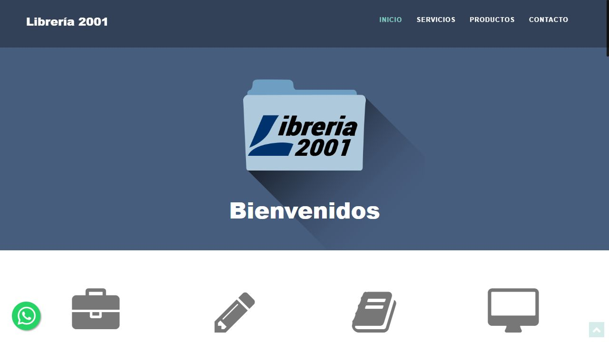
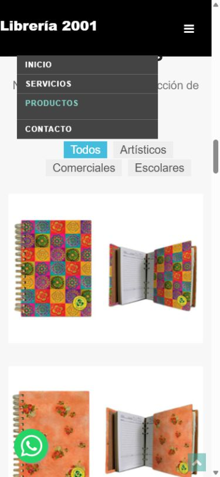

# Auditoría de Librería 2001

Fecha: 2 de octubre de 2026. Sitio: https://libreria2001.com.ar/.

Objetivo acordado: renovar la presentación conservando la identidad, modernizar JavaScript y mejorar la captación desde búsquedas hacia WhatsApp y visitas al local. El negocio funciona **desde 1992**, según confirmó su propietario.

La recomendación es una renovación progresiva: corregir los problemas de contacto y SEO técnico, simplificar el código y desarrollar una presentación más cuidada alrededor de la trayectoria del negocio. El alcance actual se puede resolver con HTML, CSS y JavaScript nativo; no necesita incorporar un framework ni un carrito.

## Alcance y límites

Se revisaron el repositorio, el HTML publicado, robots.txt, sitemap.xml, respuestas HTTP, consola del navegador y presentación de escritorio y a un ancho configurado de 390 px. Esta última prueba es de diseño adaptable en navegador, no una prueba en un teléfono físico. El ancho útil registrado fue de 375 px con la barra de desplazamiento.

El volumen de visitas es un dato aportado por el propietario. No se accedió a Search Console, Analytics ni al panel de Perfil de Empresa; por eso no se pueden afirmar posiciones, consultas que generan tráfico, conversiones o pérdidas actuales de visitas. El acceso a esas herramientas sigue pendiente de confirmar.

La API pública de PageSpeed respondió HTTP 429 por cuota agotada. No se obtuvieron puntuaciones Lighthouse ni valores de Core Web Vitals. Los pesos de archivos de este informe son tamaños locales sin compresión, no transferencia de red ni tiempo de carga.

Esta entrega agrega únicamente la auditoría y sus capturas. No cambia ni publica la web.

## Lo que ya está bien

- Contenido servido en HTML: nombre, servicios, productos, dirección y horarios están disponibles sin depender de una aplicación que genere el texto.
- Idioma español y meta viewport declarados.
- Título y descripción que identifican la actividad y Avellaneda.
- Canonical, Open Graph y JSON-LD de tipo `Store` existentes. Hay que corregir su consistencia, no partir de cero.
- robots.txt permite el rastreo y enlaza el sitemap; ambos recursos responden 200.
- Fotografías con texto alternativo y carga diferida en las imágenes de servicios y productos.
- El acceso HTTP a la raíz redirige mediante 301 a HTTPS.
- Identidad visual reconocible: logo, azul `#475D7E`, fondos claros y acentos turquesa.

## Hallazgos priorizados

P1 significa resolver en la primera intervención; P2, en la renovación; P3, mantenimiento posterior. Los impactos son valoraciones cualitativas, no estimaciones de tráfico.

| Prioridad | Hallazgo y evidencia | Acción propuesta | Beneficio esperado |
| --- | --- | --- | --- |
| P1 | `https://www.libreria2001.com.ar/` responde 301 hacia la raíz sin www, pero canonical, sitemap, robots y URLs del JSON-LD apuntan a www. Ver `index.html:10`, `index.html:41`, robots.txt y sitemap.xml. | Adoptar la raíz HTTPS sin www como referencia consistente con la redirección vigente; revisar primero la canónica elegida por Google en Search Console si está disponible. Alinear canonical, sitemap, robots y metadatos. | Señales de indexación coherentes. No se comprobó una penalización. |
| P1 | Al pulsar el botón flotante de WhatsApp se registró `ReferenceError: gtag is not defined`. `js/whatsapp-button-standalone.js:3` llama a una función que no tiene instalación correspondiente observada. | Usar un enlace HTML independiente de Analytics. Registrar el clic solo si existe una integración configurada y verificada. | Contacto robusto y medición verificable. El error demuestra que falla la medición; no demuestra que WhatsApp deje de abrirse. |
| P1 | El menú móvil permanece desplegado al elegir Productos y tapa el título y los filtros. Reproducido también tras una carga nueva. | Cerrar al seleccionar una sección, ajustar el desplazamiento a la altura del encabezado y mantener el estado accesible del botón. | Navegación usable en pantallas pequeñas. |
| P1 | El teléfono visible es `7398-1174`, pero el enlace marca `tel:+541147398-1174` (`index.html:549`): hay un dígito adicional respecto del texto mostrado. | Confirmar el número real. Si el visible es correcto, normalizar a `+541173981174`. No se hizo una llamada de prueba. | Evitar derivar consultas telefónicas al número equivocado. |
| P1 | No se encontró una etiqueta activa GA4/GTM en el HTML local ni publicado; los fragmentos antiguos de Analytics están comentados. | Confirmar cuentas existentes e instalar/verificar eventos de WhatsApp, llamada y cómo llegar. | Medir el resultado comercial de la renovación. No prueba que no exista medición por otros medios. |
| P2 | En la prueba inicial de escritorio a móvil se superpusieron imágenes de la galería: tres primeras tarjetas con la misma posición vertical y contenedor de 372 px. En una carga nueva móvil el contenedor fue de 5.490 px y las tarjetas se ordenaron. | Reemplazar la disposición con Isotope por CSS Grid y reservar proporciones de imágenes. Si se conserva temporalmente Isotope, recalcular después de cargar imágenes y cambiar tamaño. | Disposición estable durante carga y cambios de pantalla. Es un problema observado en esa secuencia, no en todas las cargas móviles. |
| P2 | jQuery 1.10.2, Bootstrap 3.1.0, fancyBox 2.1.5 e Isotope 1.5.25, identificados en sus propios archivos. | Retirar dependencias por función, con comprobación de menú, filtros, visor y enlaces. Evitar una sustitución aislada de jQuery que deje plugins incompatibles. | Menos mantenimiento y menos código ejecutado. |
| P2 | 22 imágenes HTML sin atributos de ancho/alto ni `srcset`; la galería usa originales de 720 × 550 px. | Agregar dimensiones/proporciones, tamaños adaptables y WebP/AVIF con alternativa cuando corresponda. | Menor descarga y menor riesgo de saltos de contenido. El CLS real todavía no fue medido. |
| P2 | La portada dice “Bienvenidos”; no comunica 1992, ubicación ni una acción principal. El único H1 es el nombre de la marca en el encabezado. | Dar a la portada un H1 descriptivo, trayectoria, dirección y botones de WhatsApp y cómo llegar. | Entender de inmediato qué ofrece el negocio y cómo contactarlo. |
| P2 | Las categorías son filtros con `href="#"`; no tienen páginas propias. Los servicios tienen descripciones muy breves. | Crear contenido útil por servicio y, según Search Console y demanda real, páginas específicas enlazadas desde la portada. | Atender búsquedas por servicio además de búsquedas por marca. Una sola página no es por sí misma una infracción SEO. |
| P2 | `css/style.css:75` elimina globalmente el contorno de foco; el botón del menú carece de nombre claro y los nombres de productos dependen de hover. | Foco visible, controles con nombre, tarjetas con texto siempre visible, teclado y preferencia de movimiento reducido. | Mejor lectura y operación mediante teclado o pantalla táctil. |
| P2 | Maps se carga antes de varios scripts propios; consola con avisos de carga sin `loading=async`, `addDomListener` y marcador antiguos. | Para este sitio, priorizar un enlace claro de cómo llegar y mapa con carga diferida. Mantener la API completa solo si una función la justifica. | Menos trabajo inicial y mantenimiento. El mapa llegó a mostrarse; los avisos no significan que esté inutilizable. |
| P3 | Se solicita `pill.js`, que está vacío, y `validate.js`, que busca un formulario inexistente y un endpoint PHP ausente del repositorio. | Eliminar esas referencias al limpiar la plantilla. | Menos solicitudes y código residual. No se detectó un formulario de contacto roto, porque no existe uno en el HTML. |
| P3 | Lato se importa por HTTP y mediante `@import`; hay reglas de sliders y otras secciones no utilizadas. | Servir tipografía por HTTPS o localmente, reducir variantes y depurar CSS. | Carga de estilos más predecible y consistencia visual. No se confirmó el bloqueo de la fuente en todos los navegadores. |

Google recomienda que redirecciones, canonical y sitemap indiquen la misma versión preferida de una página. La incoherencia observada justifica corregir esas señales, aunque no permite atribuirle una pérdida concreta de tráfico. [Guía de canonicalización de Google](https://developers.google.com/search/docs/crawling-indexing/consolidate-duplicate-urls?hl=es).

## Evidencia técnica

| URL consultada | Respuesta observada |
| --- | --- |
| `http://libreria2001.com.ar/` | 301 a HTTPS sin www; destino 200 |
| `https://libreria2001.com.ar/` | 200 |
| `https://www.libreria2001.com.ar/` | 301 a HTTPS sin www; destino 200 |
| `https://libreria2001.com.ar/index.html` | 200; variante accesible a tener en cuenta en la canonicalización |
| `https://libreria2001.com.ar/robots.txt` | 200; sitemap declarado con www |
| `https://libreria2001.com.ar/sitemap.xml` | 200; contiene una única URL, con www |

No se observó `noindex` en el HTML publicado ni `X-Robots-Tag` en las cabeceras consultadas. Esto permite descartar esos bloqueos concretos, pero no certifica el estado de indexación en Google.

El sitemap declara `lastmod` 2026-04-25, coincidente con la fecha del último commit observado, `8abbb50`. No corresponde actualizar esa fecha automáticamente: debe reflejar cambios significativos del contenido.

| Inventario local referenciado por el HTML | Tamaño sin compresión |
| --- | ---: |
| 16 archivos JavaScript locales, incluido uno vacío | 362.285 bytes, aproximadamente 362 KB |
| niceScroll, por sí solo | 109.850 bytes |
| jQuery, por sí solo | 93.113 bytes |
| 22 imágenes incluidas mediante `` | 2.232.904 bytes, aproximadamente 2,23 MB |

Además hay un script externo de Maps y recursos que este incorpora. Las imágenes de fondo CSS no están sumadas a las 22 anteriores. El tamaño total del repositorio no equivale al peso de una visita; las imágenes con carga diferida tampoco necesariamente se descargan todas al entrar.

## Modernización de JavaScript

| Función actual | Reemplazo propuesto |
| --- | --- |
| Bootstrap para menú y columnas | CSS Grid/Flexbox y un botón con estado accesible |
| Isotope para categorías y disposición | Grid y filtros nativos que oculten tarjetas; controles de tipo botón con estado activo |
| fancyBox para ampliar imágenes | Visor accesible con `dialog`, cierre con Escape, nombre y retorno del foco |
| scrollTo, localScroll y easing | Enlaces de ancla, `scroll-behavior` y `scroll-margin-top` |
| niceScroll | Desplazamiento del navegador |
| skrollr y Stellar | Efectos CSS discretos, opcionales y desactivables con movimiento reducido |
| appear para marcar sección | IntersectionObserver si sigue siendo útil |
| Widget de WhatsApp inyectado con jQuery | Enlace presente en HTML y medición opcional separada |
| Modernizr/Respond | Retirar tras acordar soporte de navegadores; no son necesarios para la propuesta de navegadores actuales |

`main.js:18` y `main.js:108` asignan dos mecanismos de desplazamiento a la navegación, con duraciones diferentes. Conviene dejar uno solo. La inicialización de la galería en `window.load` y la ausencia de dimensiones reservadas son factores plausibles de la superposición observada; esta auditoría no aisló una causa única.

Las versiones antiguas también merecen revisión de seguridad: jQuery documentó correcciones de XSS posteriores a la versión instalada. No se intentó explotar el sitio ni se verificó una ruta explotable en este proyecto. [Aviso oficial de jQuery](https://blog.jquery.com/2020/04/10/jquery-3-5-0-released/).

## Dirección visual propuesta

Conservar el logo y el azul existente como referencia principal; usar blanco y gris cálido para dar espacio, y el turquesa en acciones puntuales. El acabado premium debe surgir de una tipografía legible, alineaciones precisas, fotografías coherentes y textos concretos.

La portada podría comunicar:

> **Tu librería y papelería en Avellaneda, desde 1992.**
>
> Artículos escolares, de oficina y artística. Impresiones y copiado de libros contables, con atención personalizada.
>
> Consultar por WhatsApp · Cómo llegar
>
> Av. Mitre 634, locales 7 y 10 · Avellaneda

Usar “Desde 1992” evita mantener un contador anual y aporta una historia concreta. No se debe derivar de ese dato que el dominio tiene la misma antigüedad o que el negocio recibe un beneficio automático de posicionamiento.

Orden recomendado de la portada:

1. Marca, trayectoria, actividad, ubicación y dos acciones principales.
2. Servicios con información suficiente para decidir y consulta contextual.
3. Categorías de productos con nombres siempre visibles y fotos proporcionadas.
4. Breve historia del negocio y fotos reales del local/equipo cuando estén disponibles.
5. Dirección, horarios, teléfono, WhatsApp y acceso claro a indicaciones de Maps.

La galería actual es una selección de productos, no un inventario verificado. Conviene usar “Consultar disponibilidad” y revisar si modelos y marcas fotografiados siguen vigentes antes de presentarlos como stock actual. Las fotos reales y reseñas auténticas pueden apoyar la confianza; el informe no presupone disponer de material nuevo ni de una valoración determinada.

## SEO orientado a Avellaneda

La prioridad es conservar la captación existente y ampliar la respuesta a búsquedas locales con intención de consulta. Estas son hipótesis de contenido, no palabras clave con volumen comprobado:

| Intención de búsqueda | Contenido propuesto |
| --- | --- |
| Librería / papelería en Avellaneda | Portada: ubicación, categorías, trayectoria y contacto |
| Impresiones y fotocopias en Avellaneda | Tipos de trabajos, formatos confirmados, preparación de archivos, consultas y retiro |
| Copiado de libros contables en Avellaneda | Explicación del servicio, qué llevar, condiciones y tiempos confirmados |
| Librería artística en Avellaneda | Materiales y marcas reales, orientación y consulta de disponibilidad |
| Artículos escolares y de oficina | Categorías reales y forma de consultar pedidos |

Las páginas de servicios se justifican cuando aportan contenido distinto y útil. No crear páginas repetidas por cada barrio, ni prometer formatos, precios, entregas o ventas mayoristas sin confirmación. La documentación de Google destaca la utilidad del contenido y la organización comprensible del sitio. [Guía SEO de Google](https://developers.google.com/search/docs/fundamentals/seo-starter-guide?hl=es).

La ficha de Google Maps/Perfil de Empresa es parte del trabajo de captación local: comprobar propiedad, categoría adecuada a papelería y artística, nombre, dirección exacta dentro de la galería, horarios habituales y especiales, web canónica, fotografías y gestión de reseñas. Esa ficha todavía no fue auditada. Google identifica relevancia, distancia y prominencia como factores de resultados locales. [Ayuda de Perfil de Empresa](https://support.google.com/business/answer/7091?hl=es).

El JSON-LD `Store` existente es una base razonable. Alinear su URL con la canónica, confirmar que teléfono, horarios y coordenadas representen al negocio y reflejar 1992 mediante `foundingDate` si se incorpora también a la información visible. No cambiar a `BookStore` solo por la palabra “librería”: la actividad publicada es papelería, artística y servicios. Validar el marcado con la prueba de resultados enriquecidos; no se ejecutó esa validación en esta auditoría. [Datos estructurados de empresa local](https://developers.google.com/search/docs/appearance/structured-data/local-business?hl=es).

## Plan de implementación y protección del tráfico

| Etapa | Entregable concreto | Criterio para avanzar |
| --- | --- | --- |
| 1. Línea de base | Consultas, páginas, dispositivos, clics e impresiones de Search Console; medición existente y principales enlaces entrantes | Documentar qué trae visitas actualmente. Comparar con el mismo período del año anterior cuando haya datos por la estacionalidad escolar. |
| 2. Correcciones prioritarias | Canonical consistente, enlaces de contacto correctos, menú móvil y evento de WhatsApp robustos | Las rutas actuales siguen disponibles; navegación y contactos pasan la comprobación manual. |
| 3. Renovación visual y técnica | Portada desde 1992, estructura adaptable, galería estable, JS reducido e imágenes optimizadas | Revisión a 360/390/768/1280 px, teclado, cambios de tamaño, carga lenta y comportamiento de enlaces. |
| 4. Contenido local | Descripciones y páginas de servicios que la demanda y la oferta real justifiquen | Texto único, enlaces HTML, títulos propios, canonical y sitemap correctos. |
| 5. Publicación y seguimiento | Despliegue verificable y comparación de resultados | Revisar indexación, errores, clics de contacto y métricas de experiencia después del despliegue. |

Conservar la raíz, el dominio y los anclajes actuales (`#header`, `#Section-about`, `#section-works`, `#section-contact`) durante la primera renovación evita romper accesos guardados. Si se decide cambiar una URL indexada, preparar una redirección permanente al equivalente; una sustitución global hacia la portada no sirve para páginas con contenido distinto.

Mantener los servicios que ya describe el sitio, los archivos de verificación y un estado de código recuperable. Las correcciones de canonical deben coordinarse con las redirecciones existentes, no invertirlas sin motivo. Verificar en producción que no se publique un `noindex` de pruebas.

El éxito comercial debe medirse por consultas útiles. Un clic en WhatsApp o en cómo llegar es una señal de intención, no una conversación, una venta ni una visita física confirmada. Registrar eventos sin enviar el texto de conversaciones ni datos del cliente como parámetros.

Objetivos de experiencia para medir posteriormente: LCP hasta 2,5 s, INP hasta 200 ms y CLS hasta 0,1, evaluados con datos reales cuando estén disponibles. Son objetivos, no resultados del sitio actual. [Métricas web principales de Google](https://developers.google.com/search/docs/appearance/core-web-vitals?hl=es).

## Referencias visuales de la revisión

Portada de escritorio, conservada como referencia de identidad:

Menú móvil después de elegir Productos: permanece abierto sobre el contenido. En esta captura de la carga nueva la galería está ordenada; no representa la superposición detectada en la secuencia anterior de cambio de tamaño.

## Datos para completar la siguiente etapa

- Acceso o exportación de Search Console y Analytics, si existen.
- Confirmación del teléfono fijo, horarios actuales y servicios efectivamente disponibles.
- Estado del Perfil de Empresa y enlace de la ficha correcta.
- Disponibilidad de fotografías actuales del local, atención y productos.

La primera intervención recomendada agrupa las correcciones P1 y la presentación “Desde 1992”. La expansión de páginas se prioriza después con las consultas reales y los servicios que más convenga impulsar.
